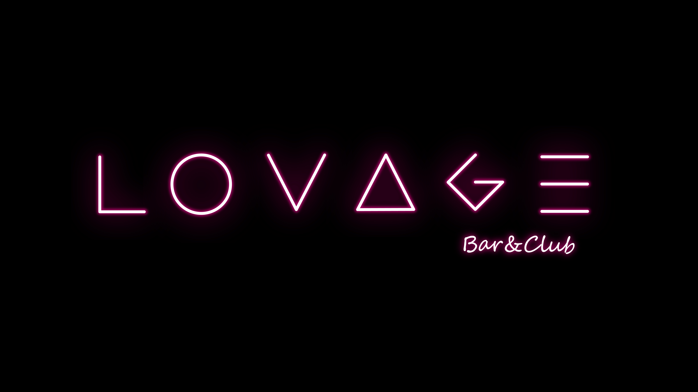

# Lovage - Modern Torrent Streaming Platform



Lovage is a modern web application that combines torrent search and streaming capabilities in a sleek, user-friendly interface. Built with Next.js 14, TypeScript, and modern UI frameworks, it offers a seamless experience for searching and streaming torrent content.

## Features

### Movie Discovery

- **Advanced Search**:

  - High-quality movie results
  - Poster previews in search
  - IMDb ratings integration
  - Smart filtering (100+ votes required)
  - Real-time search with debouncing
  - Loading states with skeletons

- **Movie Categories**:

  - Popular movies section
  - Action movies collection
  - Thriller movies showcase
  - Dynamic loading states
  - Hover effects with ratings

- **Hero Section**:
  - Daily featured movie
  - High-resolution backdrop
  - Movie details overlay
  - Watch & Info buttons
  - Rating display

### UI/UX Features

- **Modern Navigation**:

  - Elegant sidebar design
  - Tooltip-style labels
  - Smooth hover transitions
  - Fixed position icons
  - Non-intrusive layout

- **Loading States**:

  - Skeleton loaders for movies
  - Smooth transitions
  - Loading indicators
  - Placeholder content
  - Graceful error states

- **Debug Tools**:
  - Real-time logging
  - Action tracking
  - Error monitoring
  - Clear log history
  - Collapsible panel

### Torrent Search Engine

- **Multi-Source Search**: Search across multiple torrent sources:

  - YTS (Movies only, high quality)
  - The Pirate Bay (Wide variety)
  - 1337x (Large selection)
  - RARBG (Quality releases)

- **Advanced Filtering**:

  - Source selection
  - Minimum seeders filter
  - Multiple sorting options (seeders, leechers, size, name)
  - Quality filters
  - Size filters

- **Smart UI Features**:
  - Infinite scroll loading
  - Real-time search results
  - Loading states with skeletons
  - Responsive design
  - Modern card-based layout

### Streaming Features

- **WebTorrent Integration**: Stream torrents directly in the browser
- **Video Player Controls**: Full video player functionality
- **Stream Status**: Real-time download status and progress
- **Magnet URI Support**: Direct streaming from magnet links

### UI Components

- **Modern Sidebar Navigation**:
  - Elegant frosted glass design
  - Smooth hover animations
  - Responsive layout
  - Intuitive navigation icons
  - Clean and minimal interface
  - Seamless transitions

## Technical Stack

### Frontend

- **Framework**: Next.js 14 with App Router
- **Language**: TypeScript
- **UI Components**: shadcn/ui
- **Styling**: Tailwind CSS
- **Icons**: Lucide Icons
- **State Management**: React Hooks

### Backend

- **API Routes**: Next.js API Routes
- **Torrent Client**: WebTorrent
- **Movie Data**: TMDB API
- **Torrent Search**: Custom API integrations

## Project Structure

```plaintext
src/
├── app/                    # Next.js app directory
│   ├── api/               # API routes
│   │   └── search/        # Torrent search endpoints
│   ├── dev/              # Development routes
│   │   ├── streamtest/   # Streaming test page
│   │   └── torrent-search-engine/ # Search interface
│   └── page.tsx          # Home page
├── components/            # React components
│   ├── dev-tools/        # Development tools
│   ├── layout/           # Layout components
│   ├── movies/           # Movie-related components
│   ├── settings/         # Settings components
│   └── ui/               # UI components (shadcn)
├── hooks/                # Custom React hooks
├── lib/                  # Core utilities
│   ├── api/             # API related functions
│   ├── tmdb/            # TMDB API integration
│   ├── torrent-search/  # Torrent search providers
│   └── utils/           # Helper functions
├── styles/               # Global styles
└── types/               # TypeScript types
```

## Core Components

### Torrent Search Engine (\`/dev/torrent-search-engine\`)

- **Features**:
  - Multi-provider search
  - Infinite scroll
  - Advanced filtering
  - Sort options
  - Magnet link handling
  - Stream integration

### Stream Test (\`/dev/streamtest\`)

- **Features**:
  - WebTorrent streaming
  - Video player
  - Progress tracking
  - Status updates

## API Integration

### Search API (\`/api/search\`)

- **Endpoints**:
  - GET \`/api/search\`: Search torrents
    - Query params:
      - \`query\`: Search term
      - \`providers\`: Comma-separated list of providers

### Supported Providers

1. **YTS**

   - Movies only
   - High-quality releases
   - Multiple quality options

2. **The Pirate Bay**
   - Wide variety of content
   - Large peer network
   - Extensive database

## Setup and Development

### Prerequisites

- Node.js 18.17 or later
- npm or yarn
- Git

### Installation

1. Clone the repository:

```bash
git clone https://github.com/esatirk/lovage.git
cd lovage
```

2. Install dependencies:

```bash
npm install
```

3. Set up environment variables:

```bash
cp .env.example .env.local
# Edit .env.local with your TMDB API key
```

4. Run the development server:

```bash
npm run dev
```

5. Open [http://localhost:3000](http://localhost:3000) in your browser.

## Usage

### Search Interface

1. Navigate to `/dev/torrent-search-engine`
2. Enter search query
3. Use filters and sort options
4. Click on actions:
   - Copy magnet link
   - Visit source
   - Stream content

### Streaming

1. Navigate to `/dev/streamtest`
2. Enter magnet URI
3. Wait for connection
4. Stream content

## Contributing

1. Fork the repository
2. Create your feature branch:

```bash
git checkout -b feature/amazing-feature
```

3. Commit your changes:

```bash
git commit -m 'Add amazing feature'
```

4. Push to the branch:

```bash
git push origin feature/amazing-feature
```

5. Open a Pull Request

## Development Guidelines

### Code Style

- Use TypeScript for type safety
- Follow ESLint configuration
- Use Prettier for formatting
- Write meaningful commit messages

### Component Guidelines

- Use functional components
- Implement proper prop types
- Keep components focused and reusable
- Add JSDoc comments for complex logic

### Testing

- Write unit tests for utilities
- Add component tests for complex components
- Test edge cases and error states

## License

This project is licensed under the MIT License - see the [LICENSE](LICENSE) file for details.

## Acknowledgments

- [Next.js](https://nextjs.org/) for the amazing framework
- [shadcn/ui](https://ui.shadcn.com/) for beautiful UI components
- [WebTorrent](https://webtorrent.io/) for the streaming capabilities
- [TMDB](https://www.themoviedb.org/) for the movie database
- [YTS](https://yts.mx/), [The Pirate Bay](https://thepiratebay.org/), [1337x](https://1337x.to/), and [RARBG](https://rarbg.to/) for their content
